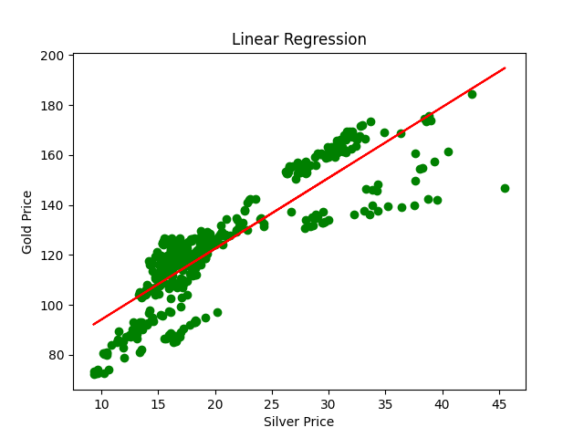
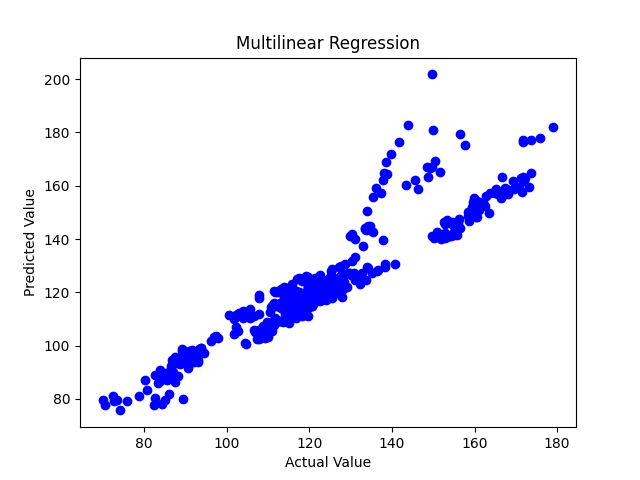

# Gold Price Prediction ML Project

This project focuses on predicting gold prices using machine learning techniques. It includes data preprocessing, exploratory data analysis, and the implementation of three different regression models: Linear Regression, Multilinear Regression, and Decision Tree Regression. Additionally, it features Random Forest Regression for improved accuracy. The project provides data visualizations to gain insights into the dataset and evaluates model performance.

## Features

- Data preprocessing and exploration.
- Linear Regression for gold price prediction.
- Multilinear Regression to analyze multiple variables.
- Decision Tree Regression for non-linear relationships.
- Random Forest Regression for enhanced accuracy.
- Visualizations to understand data and predictions.

## Models and Output

### Linear Regression

This model utilizes a simple linear regression approach for gold price prediction.



### Multilinear Regression

In this model, we analyze multiple variables to enhance gold price prediction.



### Decision Tree Regression

We investigate non-linear relationships within the data using Decision Tree Regression.


### Random Forest Regression

To enhance accuracy, we employ a Random Forest Regression model.


## How to Use

1. Clone the repository to your local machine:

   ```shell
   git clone https://github.com/yourusername/Gold-Price-Prediction.git
